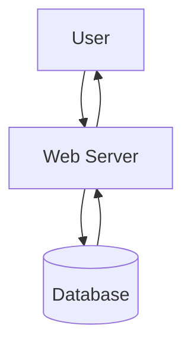

# システム設計

## システム構造図

## ハードウェア・ソフトウェア

### デプロイ

|サービス名|役割|選定理由|
|----|----|----|
|Render|Web Server・DB|無料で使用できる。段階的に価格を上げられる。|

## IDE

- Visual Studio

  バックエンドに.NETを採用するため。

- Visual Studio Code

  フロントエンドを記述する。

## 開発技術

### バックエンド

.NET6

採用理由： 普段使用している技術であり、一番なじみがある。VSによって開発が楽。

### フロントエンド

React, Vite

採用理由: SPAでスマホアプリのような、ストレスない操作性を実現したいため。クライアント側でレンダリングしても負荷がかからないと見込まれるため。
