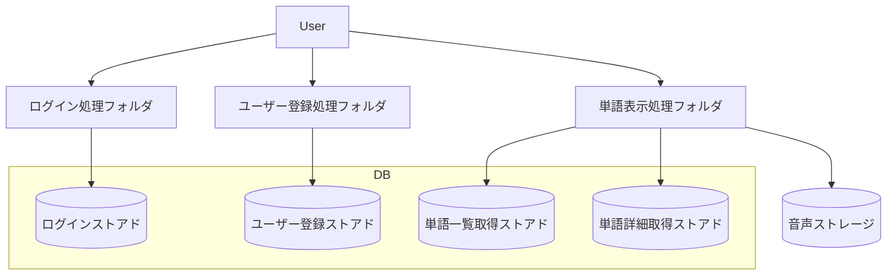
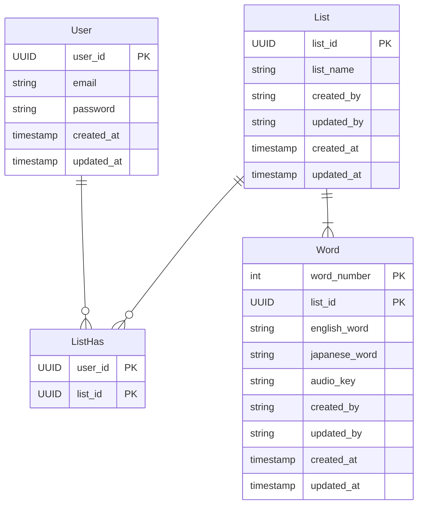

# 外部設計

## バックエンド

### 構造図

### 機能概要

#### ログイン処理フォルダ

ログイン・ログアウトに関わる処理を行う。
ログインストアド呼び出し、結果API返却

#### ユーザー登録処理フォルダ

ユーザー登録に関わる処理を行う。
ユーザー登録ストアド呼び出し、API返却

#### 単語表示処理フォルダ

単語表示に関わる処理を行う。
単語一覧表示、単語詳細表示のAPI返却

#### ログインストアド

ログイン処理のストアド。
ID・PWチェック。

#### ユーザー登録ストアド

ユーザー登録のストアド。
ID・PW使用可能チェック、登録処理。

#### 単語一覧取得ストアド

単語一覧取得のストアド。
単語の一覧を取得する。

#### 単語詳細取得ストアド

指定した単語の詳細を取得する。
単語・日本語訳・音声。

## フロントエンド

### 設計方針

||API通信|グローバルState|Style|依存関係|
|-|-|-|-|-|
|Parts|×|×|〇|parts|
|Templates|△|〇|〇|parts, templates|
|Views|○（client）|〇|△|parts,templates|
|Pages|○（ssr）|×|×|views|

引用：<https://zenn.dev/offers/articles/20220523-component-design-best-practice#%E5%90%84%E3%83%AC%E3%82%A4%E3%83%A4%E3%83%BC%E3%81%AB%E3%81%8A%E3%81%91%E3%82%8B%E8%B2%AC%E5%8B%99%E3%81%AE%E6%97%A9%E8%A6%8B%E8%A1%A8>

Atomic Designはコンポーネントの分類がうまくいかないため今回は採用を見送る。

代わりに引用元の記事で紹介されていたParts,Templates,Views,Pagesの４つに分ける。

基本的には同階層で依存関係を持たないようにする。

### Parts

ロジックを持たない部品としてのコンポーネント。

### Templates

- partsを組み合わせて作るもの。
- ヘッダー、フッダーなど大きめのコンポーネント。
- API通信をするもの。
- グローバルStateを持つもの。

  などをここに置く。

### Views

Parts,Templatesを組み合わせて画面を作成する。

### Pages

ViewsをもとにURLに対応した画面を作る。基本はViewsを引っ張ってくるだけ。rootとしての意味合いが強い。

## DB構成

- ユーザー管理テーブル(User)
- 単語テーブル(Word)
- 単語リストテーブル(List)
- 単語リスト所有テーブル(ListHas)

