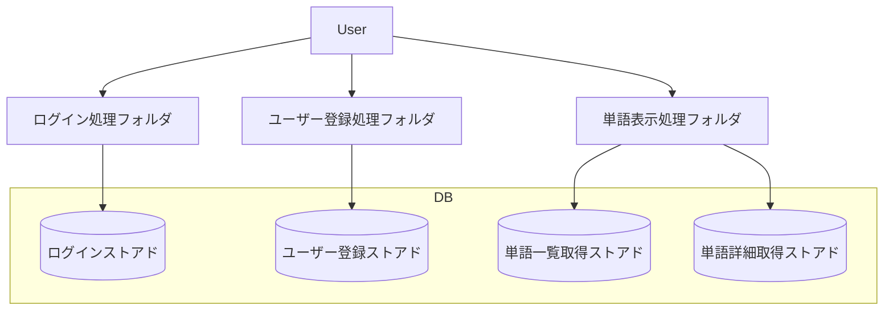

# 機能設計

## バックエンド

### 構造図

### 機能概要

#### ログイン処理フォルダ

ログイン・ログアウトに関わる処理を行う。
ログインストアド呼び出し、結果API返却

#### ユーザー登録処理フォルダ

ユーザー登録に関わる処理を行う。
ユーザー登録ストアド呼び出し、API返却

#### 単語表示処理フォルダ

単語表示に関わる処理を行う。
単語一覧表示、単語詳細表示のAPI返却

#### ログインストアド

ログイン処理のストアド。
ID・PWチェック。

#### ユーザー登録ストアド

ユーザー登録のストアド。
ID・PW使用可能チェック、登録処理。

#### 単語一覧取得ストアド

単語一覧取得のストアド。
単語の一覧を取得する。

#### 単語詳細取得ストアド

指定した単語の詳細を取得する。
単語・日本語訳・音声。

## フロントエンド

