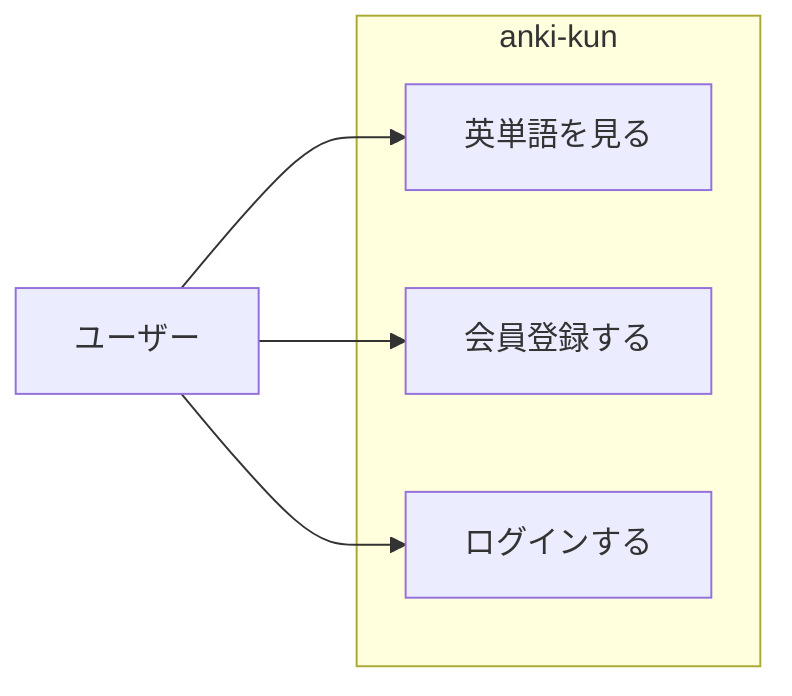

# 単語暗記くん要件定義

## 5W1H

|5W1H|内容|
|----|----|
|Who|英単語を音声付きで手軽に学びたい人|
|What|自分で単語・音声を登録でき、学習できるサイト|
|When|未定|
|Where|設計からリリースまで|
|Why|英単語を効率的に覚えたいため|
|How|.NET6, Postgresql, React|

## 機能要件

### ユースケース図

### 機能

- 単語セットを選べる

- 英単語の一覧を表示できる
  - １から順番に表示する。

- 英単語の詳細画面を表示
  - 英単語、日本語訳、音声発声ボタン

- ログイン機能
  - メールアドレス、パスワードでログイン

### 使用技術

Dockerを利用しバックエンド、フロントエンド、データベースのコンテナを作成する。

#### バックエンド

Dockerイメージ
<https://hub.docker.com/_/microsoft-dotnet/?tab=description>

.NET6でAPIを作成する。

IDEはVisual studio 2022

#### フロントエンド

Dockerイメージ
<https://hub.docker.com/_/node>

Node.js v16.18.0

Reactで開発を行う。Typescriptを利用。

使用するフレームワークはVite

API取得にはReact Query。

SSRとして実装する。

IDEはVScode

#### その他

|名前|内容|
|-|-|
|DB|PostgreSQL 14 <https://hub.docker.com/_/postgres>|
|デプロイ|Render|
|バージョン管理|Git + GitHub|
