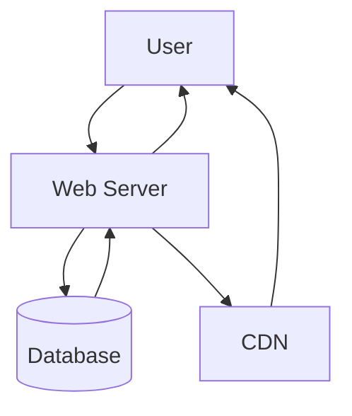

# 単語暗記くん要件定義

## 5W1H

|5W1H|内容|
|----|----|
|Who|英単語を音声付きで手軽に学びたい人|
|What|自分で単語・音声を登録でき、学習できるサイト|
|When|未定|
|Where|設計からリリースまで|
|Why|英単語を効率的に覚えたいため|
|How|.NET6, Postgresql, React(Next.js) + CDN|

## 概要

### システム構造図

## 機能要件

### 機能

- 英単語の一覧を表示できる
  - 続き、まだ学習していないもの
    - 検索、絞り込み、ソードなどがあるとよい

- 英単語の詳細画面を表示
  - 英単語、日本語訳、音声発声ボタン
    - お気に入りボタンなどのユーザーがフラグをつけるボタンなどもあるとよい

- 単語登録画面
  - 単語、日本語訳、音声アップロード
    - その他一括登録できるもの。とりあえずCSV

- 単語一括編集
  - 順番の並べ替え、削除

- 単語詳細編集
  - 登録した各単語の編集など

- ログイン機能
  - メアド、SNS認証

### 情報・データ・ログ

- 単語
- 日本語訳
- 音声
  - できればCDNに入れたい

- メールアドレス・ログインID
- パスワード

## 非機能要件

### ユーザビリティ

- レスポンスは1秒以内
- 音声再生は即時レスポンス
- ログイン後はすぐ学習できるように単語一覧を表示
