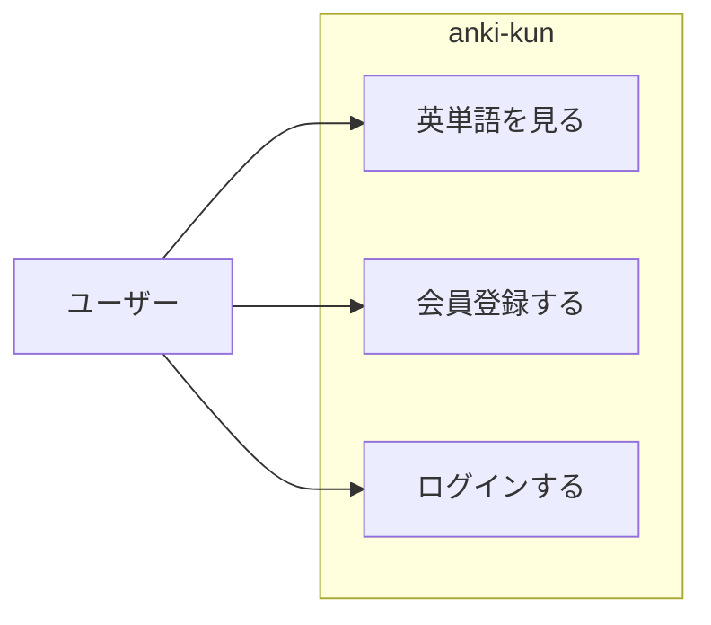

# 単語暗記くん要件定義

## 5W1H

|5W1H|内容|
|----|----|
|Who|英単語を音声付きで手軽に学びたい人|
|What|自分で単語・音声を登録でき、学習できるサイト|
|When|未定|
|Where|設計からリリースまで|
|Why|英単語を効率的に覚えたいため|
|How|.NET6, Postgresql, React(Next.js)|

## 機能要件

### ユースケース図

### 機能

- 単語セットを選べる
  - 今回は１つだけ。

- 英単語の一覧を表示できる
  - １から順番に表示する。

- 英単語の詳細画面を表示
  - 英単語、日本語訳、音声発声ボタン

- ログイン機能
  - メールアドレス

### 情報・データ・ログ

- 単語
- 日本語訳
- 音声

- メールアドレス・ログインID
- パスワード

## 非機能要件

### ユーザビリティ

- レスポンスは1秒以内
- 音声再生は即時レスポンス
